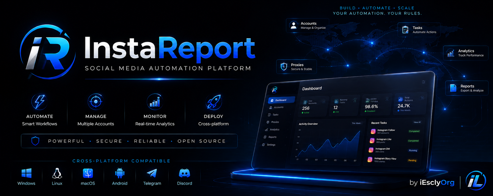

<div align="center">

<a href="https://github.com/iEsclyOrg/instaReport">
  
</a>

</div>

<br>

<div align="center">

### InstaReport

**Actively developed since 2021** &nbsp;·&nbsp; **Officially maintained by [iExly](https://github.com/iEsclyOrg)**

Originally created under the **Credly** project, later known as **iEscly**, now released as **InstaReport** by **iExly**.

---

[](https://iescly.duckdns.org)
[](https://iescly.duckdns.org/pricing)
[](https://t.me/instaReportV2Bot)
[](https://github.com/iEsclyOrg/instaReport)

[](https://github.com/iEsclyOrg/instaReport/stargazers)
[](https://github.com/iEsclyOrg/instaReport/network)
[](https://github.com/iEsclyOrg/instaReport/releases)
[](https://github.com/iEsclyOrg/instaReport/commits/main)

</div>

---

## 📑 Table of Contents

- [⭐ Official Repository](#-official-repository)
- [📖 Project History](#-project-history)
- [⚠️ Beware of Fake Copies](#-beware-of-fake-copies)
- [🚀 Why Choose InstaReport?](#-why-choose-instareport)
- [✨ Key Features](#-key-features)
- [🌍 Platform Compatibility](#-platform-compatibility)
- [🎯 What Can InstaReport Do?](#-what-can-instareport-do)
- [🔧 Supported Report Reasons](#-supported-report-reasons)
- [📥 Installation](#-installation)
- [🔑 License Activation](#-license-activation)
- [🤖 Telegram Bot](#-telegram-bot)
- [🎮 Discord Bot](#-discord-bot)
- [🔒 Security & Privacy](#-security--privacy)
- [📸 Screenshots](#-screenshots)
- [❓ Frequently Asked Questions](#-frequently-asked-questions)
- [📚 Documentation](#-documentation)
- [❤️ Community](#-community)
- [📢 Updates & Changelog](#-updates--changelog)
- [📄 Terms & Disclaimer](#-terms--disclaimer)

---

## ⭐ Official Repository

Welcome to the **official GitHub repository** of **InstaReport**.

InstaReport is a premium social media automation project that has been under **continuous development since 2021**. It combines an automated reporting engine, account management workflows, a full Telegram bot, profile lookup utilities and a secure online license system into one cross-platform product.

If you previously used **Credly** or **iEscly**, you are in the correct place — the project has simply evolved under a new identity.

> This repository is the **only official GitHub home** of InstaReport. Any other repository claiming to be official should be reported.

---

## 📖 Project History

The history of InstaReport spans multiple years of active development.

| Year | Brand |
|------|-------|
| 2021 | **Credly** |
| 2022 – 2026 | **iEscly** |
| 2026 – Present | **iExly** |

Thousands of hours have gone into building, maintaining, improving and supporting this software across multiple platforms. This repository represents the latest official release.

---

## ⚠️ Beware of Fake Copies

Due to the popularity of the project, there are unofficial repositories, fake sellers and impersonators online.

**Always verify you are using the official resources listed below** before downloading software or purchasing a license.

| Official Resource | Link |
|-------------------|------|
| 🌐 Official Website | <https://iescly.duckdns.org> |
| ⭐ Official GitHub | <https://github.com/iEsclyOrg/instaReport> |
| 💬 Official Telegram | <https://t.me/iescly> |
| 🎮 Official Discord | <https://discord.com/invite/v6ebT5aFx> |
| 📺 Official YouTube | <https://youtube.com/@iEscly> |
| 📸 Official Instagram | <https://instagram.com/i3scly> |

---

## 🚀 Why Choose InstaReport?

Unlike many public scripts or abandoned projects, InstaReport receives continuous updates, feature improvements and long-term support.

- ✅ Active development since 2021
- ✅ Regular feature releases
- ✅ Cross-platform compatibility
- ✅ Telegram integration
- ✅ Premium licensing
- ✅ Dedicated customer support
- ✅ Frequent bug fixes
- ✅ Standalone binaries — no complicated setup

InstaReport has remained under active development since **2021**, making it one of the longest-maintained projects in its category. Instead of releasing unfinished software and disappearing, every major release builds upon years of previous work.

---

## ✨ Key Features

| Feature | Included |
|---------|----------|
| 🚀 Automated Reporting Engine | ✅ |
| 🛡 Account Management Workflows | ✅ |
| 🤖 Telegram Bot | ✅ |
| 🎮 Discord Bot | ✅ |
| 🔍 Profile Information Lookup | ✅ |
| 🔑 Secure License System | ✅ |
| ⚡ Standalone Binaries | ✅ |
| 🪟 Windows Support | ✅ |
| 🐧 Linux Support | ✅ |
| 🤖 Android (Termux) | ✅ |
| 🔄 Frequent Updates | ✅ |
| ❤️ Dedicated Support | ✅ |
| 💎 Multiple License Plans | ✅ |

### Engine Highlights (v8.7.5)

- **Randomized action delays** — all timing constants apply ±30% jitter automatically to mimic human behavior and avoid detection patterns.
- **Exponential backoff on retry** — account retries use `min(10 × 2^attempt, 300s)` + random jitter instead of linear steps, greatly improving success rate under rate limits.
- **Account health pre-check** — before each campaign run, every account is tested for a valid login session. Dead accounts are skipped automatically.
- **Bulk target import** — load targets from a `.txt` file (one per line, `#` for comments).
- **Auto-update check** — on startup the app checks GitHub for new releases and offers to open the download page.
- **Campaign resume support** — campaign progress is saved to SQLite, ready for resume in a future release.
- **Proxy support** — configurable proxies with automatic blacklisting after repeated failures.
- **2FA / OTP handling** — Telegram-based OTP collection with a 120-second timeout window.
- **Stealth & safe modes** — toggleable browser stealth and safe-mode operation.

---

## 🌍 Platform Compatibility

| Platform | Status |
|----------|--------|
| 🪟 Windows 10 | ✅ Supported |
| 🪟 Windows 11 | ✅ Supported |
| 🐧 Ubuntu | ✅ Supported |
| 🐉 Kali Linux | ✅ Supported |
| 🐧 Debian | ✅ Supported |
| 🤖 Android (Termux) | ✅ Supported |
| 💬 Telegram Bot | ✅ Supported |
| 🎮 Discord Bot | ✅ Supported |
| 🚧 Future Platforms | 🚧 Planned |

---

## 🎯 What Can InstaReport Do?

| Category | Description |
|----------|-------------|
| 🚀 Reporting Engine | Automated reporting workflows with configurable behaviour, workers and retries |
| 🛡 Account Management | Tools designed to assist with account management workflows |
| 📱 Telegram Integration | Execute supported operations directly from Telegram, 24/7 |
| 🎮 Discord Integration | Run the same operations directly from a Discord server |
| 🔍 Profile Utilities | Public profile information lookup tools |
| 🔑 License System | Secure online license activation and verification |
| ⚡ Standalone Binaries | No complicated installation required |
| 📂 Bulk Import | Load multiple targets from a text file |
| 🌍 Cross Platform | Windows, Linux and Android (Termux) |

---

## 🔧 Supported Report Reasons

| Reason |
|--------|
| Spam |
| Harassment |
| Impersonation |
| Hate speech |
| Nudity |
| Violence |
| Misinformation |
| Scam / Fraud |

---

## 📥 Installation

Choose your preferred platform.

### 🪟 Windows

1. Download the latest Windows release from [GitHub Releases](https://github.com/iEsclyOrg/instaReport/releases).
2. Run:

```
InstaReport-Windows-x86-64.exe
```

3. Enter your license key.
4. Done — no additional dependencies required.

### 🐧 Linux

```bash
chmod +x InstaReport-Linux-x86_64.bin
./InstaReport-Linux-x86_64.bin
```

No Python installation required for the standalone binary.

### 🤖 Android (Termux)

> The Termux (Python) build is distributed through **official channels only**. Do not install from third-party mirrors.

```bash
pkg update
pkg install git python
# Obtain the current Python build from the official Telegram channel
git clone <official-source-url>
cd <source-folder>
pip install -r requirements.txt
python InstaReport.py
```

### 💬 Telegram Bot

The cloud-hosted Telegram bot is available at [@instaReportV2Bot](https://t.me/instaReportV2Bot). No installation required — activate your license and use it from any device.

---

## 🔑 License Activation

1. Purchase a license from the [official pricing page](https://iescly.duckdns.org/pricing).
2. Launch InstaReport.
3. Enter your activation key.
4. Begin using supported features.

Licenses are validated **online** and bound to your device hardware ID. One license key is validated against a secure licensing API (`iescly.duckdns.org`) that returns your plan and expiry date.

---

## 🤖 Telegram Bot

The Telegram bot allows supported operations directly from your phone — fully cloud-hosted and available 24/7.

### User Commands

| Command | Description |
|---------|-------------|
| `/start` | Show main menu |
| `/menu` | Open main menu |
| `/activate CODE` | Activate license |
| `/status` | Current config & stats |
| `/report <target>` | Start a report |
| `/stop` | Stop all reports |
| `/accounts` | Manage accounts |
| `/config` | View / edit settings |
| `/history [n]` | Recent runs |
| `/schedule` | Auto-report scheduling |
| `/favorites` | Saved targets |
| `/lookup` | Scrape public profile stats |
| `/unban` | Submit an appeal to a platform |
| `/balance` | Check balance |
| `/refund` | Request a refund |
| `/help` | Show this message |

### Admin Commands

| Command | Description |
|---------|-------------|
| `/users` | Manage users |
| `/ban` | Ban a user |
| `/broadcast` | Broadcast a message |
| `/banpay` | Manage ban/pay orders |
| `/admin_pending` | Review pending requests |
| `/admin_approve` | Approve a request |
| `/admin_reject` | Reject a request |
| `/set_balance` | Set user balance |
| `/migrate_balances` | Migrate balances |

Premium users unlock additional commands through their activated license.

---

## 🎮 Discord Bot

The Discord bot provides the same operations directly from your Discord server — fully cloud-hosted and available 24/7.

**Join the server:** <https://discord.com/invite/v6ebT5aFx>

Same license, same engine, same backend as the Telegram bot — activate once and use it from either platform.

### User Commands

| Command | Description |
|---------|-------------|
| `/start` | Welcome screen |
| `/menu` | Main control panel |
| `/activate` | Activate your license code |
| `/report <target>` | Start a report |
| `/stop` | Stop your active report |
| `/resume` | Resume your last interrupted campaign |
| `/accounts` | Manage your accounts |
| `/config` | View / edit report settings |
| `/status` | View config & license info |
| `/history` | Recent run logs |
| `/favorites` | Your saved favorite targets |
| `/fav add <target>` | Add a favorite target |
| `/fav del <target>` | Remove a favorite target |
| `/balance` | Check your balance |
| `/refund <amount>` | Request a refund / withdrawal |
| `/refundstatus` | Refund request history |
| `/banpay` | Purchase a ban/unban via crypto |
| `/banstatus` | Ban/unban request history |
| `/help` | List all commands |

### Admin Commands

| Command | Description |
|---------|-------------|
| `/admin pending` | List pending ban/refund requests |
| `/admin approve <id>` | Approve a ban or refund request |
| `/admin reject <id>` | Reject a ban or refund request |
| `/setbalance <user> <amount>` | Set a user's balance |
| `/migrate` | Credit legacy approved ban requests |
| `/users` | List all licensed users |
| `/ban <user>` | Revoke a user's license |
| `/broadcast <msg>` | DM all licensed users |

Premium users unlock additional commands through their activated license.

---

## 🔒 Security & Privacy

- **Online license validation** with hardware-ID binding — keys cannot be shared across devices.
- **Credential encryption** using PBKDF2 (480,000 iterations) for local credential storage.
- **No public code exposure** — the codebase is distributed exclusively through official, license-protected channels.
- **Rate-limit aware** — exponential backoff and randomized delays protect account health.
- **Account health checks** — invalid sessions are detected and skipped automatically.

If you discover a security issue, please report it privately — see [SECURITY.md](SECURITY.md).

---

## 📸 Screenshots

> Real screenshots of InstaReport are available through our official channels.

### 🖥 Desktop Version

See the [screenshots documentation](docs/screenshots.md) for desktop captures.

### 📱 Telegram Bot

See the [Telegram bot documentation](docs/telegram.md) for a walkthrough of the bot interface.

### 🎬 Live Demonstrations

Project demonstrations, customer work examples and feature previews are regularly shared through our official channels.

- **Official Work Showcase:** <https://t.me/+Q1JOkBB4a5w2MGZh>
- **Customer Vouches:** <https://t.me/iVouchiEscly>
- **Official Telegram:** <https://t.me/iescly>

---

## ❓ Frequently Asked Questions

<details>
<summary><strong>What is InstaReport?</strong></summary>

InstaReport is a premium social media automation platform developed and maintained by **iExly**. It provides automated reporting workflows, account management tools and a Telegram bot, with active development since 2021.

</details>

<details>
<summary><strong>Is this the same project as Credly / iEscly?</strong></summary>

Yes. The project began as **Credly** (2021), was rebranded to **iEscly** (2022–2026), and is now published under the **iExly** organization (2026–present). Your previous version knowledge still applies.

</details>

<details>
<summary><strong>Which platforms are supported?</strong></summary>

Windows 10/11, Ubuntu, Kali Linux, Debian, Android (Termux) and the cloud-hosted Telegram bot.

</details>

<details>
<summary><strong>Do I need Python installed?</strong></summary>

No. The Windows and Linux standalone binaries require no Python installation.

</details>

<details>
<summary><strong>How do I get a license?</strong></summary>

Visit the [official pricing page](https://iescly.duckdns.org/pricing) to purchase a license. Licenses are validated online and bound to your device.

</details>

<details>
<summary><strong>What do I do if I forgot my license or it doesn't work?</strong></summary>

Contact support via the official Telegram channel — see [SUPPORT.md](SUPPORT.md).

</details>

<details>
<summary><strong>Is there a refund policy?</strong></summary>

See the pricing page and [SUPPORT.md](SUPPORT.md) for the applicable refund terms.

</details>

<details>
<summary><strong>Where can I see updates and changes?</strong></summary>

Check the [CHANGELOG.md](CHANGELOG.md) or the [online changelog](https://iescly.duckdns.org/changelog).

</details>

---

## 📚 Documentation

| Document | Purpose |
|----------|---------|
| [Installation Guide](docs/installation.md) | Step-by-step setup for every platform |
| [Telegram Bot](docs/telegram.md) | Full bot feature and command reference |
| [Discord Bot](docs/discord.md) | Discord bot, invite and command reference |
| [Pricing](docs/pricing.md) | License plans and purchase information |
| [Architecture](docs/architecture.md) | Engine architecture and technical details |
| [Troubleshooting](docs/troubleshooting.md) | Common issues and solutions |
| [Screenshots](docs/screenshots.md) | Visual tour of the product |
| [FAQ](docs/faq.md) | Extended frequently asked questions |
| [Changelog](CHANGELOG.md) | Release history |
| [Roadmap](ROADMAP.md) | Upcoming plans |
| [Security](SECURITY.md) | How to report vulnerabilities |
| [Support](SUPPORT.md) | How to get help |
| [Contributing](CONTRIBUTING.md) | Guidelines for contributions |

---

## ❤️ Community

The InstaReport community has been growing since 2021.

- 🌐 **Website:** <https://iescly.duckdns.org>
- 💬 **Telegram:** <https://t.me/iescly>
- 🎮 **Discord:** <https://discord.com/invite/v6ebT5aFx>
- 📺 **YouTube:** <https://youtube.com/@iEscly>
- 📸 **Instagram:** <https://instagram.com/i3scly>
- ⭐ **GitHub:** <https://github.com/iEsclyOrg/instaReport>
- 🎬 **Showcase:** <https://t.me/+Q1JOkBB4a5w2MGZh>
- ✅ **Vouches:** <https://t.me/iVouchiEscly>

---

## 📢 Updates & Changelog

Every major version introduces improvements in performance, compatibility, stability, user experience, automation, licensing and documentation.

Full changelog:

- **Online:** <https://iescly.duckdns.org/changelog>
- **Repository:** [CHANGELOG.md](CHANGELOG.md)

---

## 📄 Terms & Disclaimer

- InstaReport is provided **as-is** without warranty of any kind.
- You are responsible for complying with the **terms of service** of any platform you use it with.
- Unauthorized use, redistribution or resale of this software may result in license revocation.
- See [LICENSE_GUIDE.md](LICENSE_GUIDE.md) for licensing information and [CODE_OF_CONDUCT.md](CODE_OF_CONDUCT.md) for community guidelines.

---

<div align="center">

**InstaReport** — a premium social media automation platform by [iExly](https://github.com/iEsclyOrg)

Originally **Credly** · Later **iEscly** · Now **InstaReport by iExly**

Copyright © 2021 – 2026 iExly. All rights reserved.

</div>
